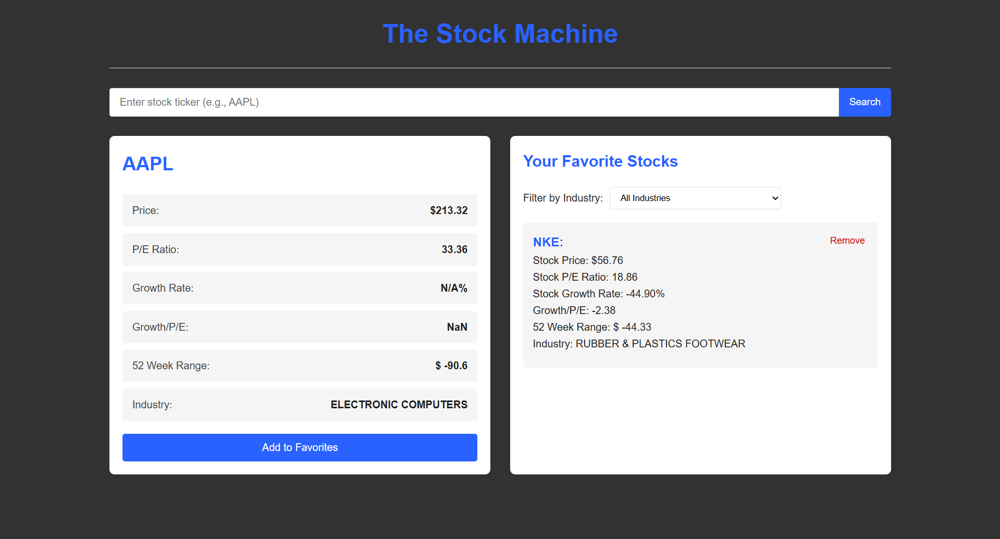

# The Stock Machine



## Description  
A more intermediate Hangman game built with React, MongoDB, using class-based components.

## Features ✨

### Stock Data
- Real-time price information
- P/E ratio analysis
- Growth rate calculations
- Growth-to-PE valuation metric
- 52-week high/low range

### Portfolio Management
- Save favorite stocks
- Filter by industry sector
- Persistent storage using localStorage
- Easy add/remove functionality

### Technical Features
- React functional components
- Alpha Vantage API integration
- Custom industry filter component
- Responsive CSS Grid/Flexbox layout
- Error handling for API limits

### Running the app

#### Prerequisites
- Node.js (v16 or higher)
- Alpha Vantage API key (free tier available)
  
1. Clone the repository of the project in the terminal using:
````
git clone https://github.com/JahmaliB/TheStockMachine.git
cd TheStockMachine
````
2. Open Docker Desktop (have it running in the background)

3. Enable MongoDB using Docker
````
docker-compose up -d
````

4. Change into the Server Directory Folder then start the server
````
cd BackendServer
node server
````
5. Go into a new terminal and Change to the current project directory
````
cd TheStockMachine
````

6. Install the frontend dependencies needed to run the program using:
````
npm install
````

7. Start the server using:
````
npm start
````

8. (Optional) Your program should open automatically but if it does not copy and paste this into your browser:
http://localhost:3000 in your browser.
